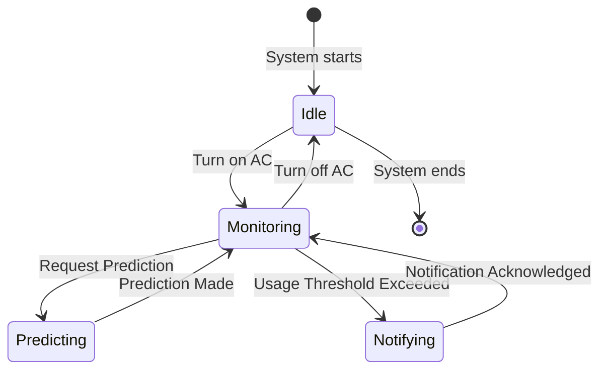
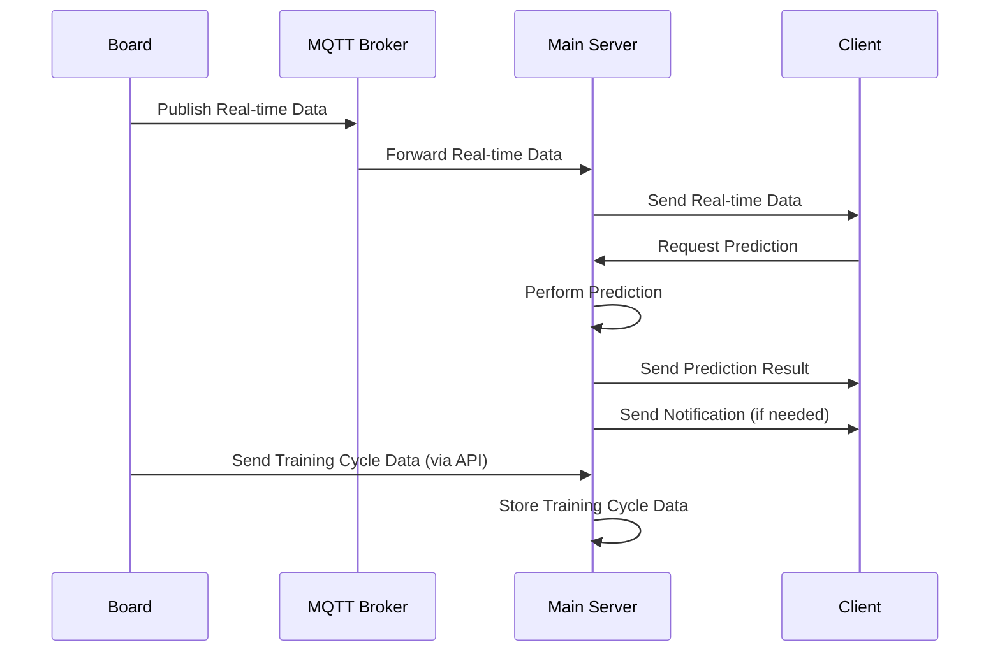

# Air Conditioner Efficiency Monitoring and Optimization System

## Overview

The Air Conditioner Efficiency Monitoring and Optimization System is an innovative solution designed to enhance comfort and energy efficiency in residential environments. This platform is pivotal for homeowners interested in optimizing their air conditioning usage, reducing energy costs, and maintaining an ideal indoor climate. By leveraging real-time data and predictive analytics, the system ensures the air conditioning operates only when necessary, contributing to sustainable living practices.

## Contributors

- Thitiphum Chaikarnjanakit
- Saponrachate​ Thamrongweingpung
- ​Witchaworn Munkong

## Stakeholders

- **Homeowners:** Primary users who interact with the system to monitor and control their indoor climate.
- **Energy Consultants:** Use the system data to provide recommendations for energy savings and efficiency improvements.
- **HVAC Technicians:** Offer technical support and use system insights for maintenance and optimization services.
- **Utility Companies:** Interested in promoting energy-efficient practices among consumers.
- **Environmental Advocates:** Focus on the system's role in reducing carbon footprints through efficient energy use.

## User Stories

### User Story 1: Real-time Temperature and Humidity Monitoring

- **As a homeowner:** I want to easily check the current temperature and humidity in my home through a simple web interface, so that I can understand my home's climate without needing technical knowledge about the sensors or data collection methods.

  - **Acceptance Criteria:**
    1.  The system displays real-time temperature and humidity data on a web interface.
    2.  Information updates automatically, reflecting the latest sensor readings.

- **As a homeowner:** I want to receive an estimate of how long it will take to reach my preferred temperature if I turn on the air conditioner now, so that I can make informed decisions about the best time to adjust my AC settings for comfort and efficiency.

### User Story 2: Air Conditioner Efficiency Prediction

- **As a homeowner:** I want to receive an estimate of how long it will take to reach my preferred temperature if I turn on the air conditioner now, so that I can make informed decisions about the best time to adjust my AC settings for comfort and efficiency.

- **Acceptance Criteria:**
  1.  Users can input or select their current indoor temperature and desired comfort level through the web interface.
  2.  The system provides a clear estimate of how long it will take to cool the room to the desired temperature using predictions based on historical temperature and humidity data.accuracy.

### User Story 3: Air Conditioner Usage Alert

- **As a homeowner:** I want to be alerted if my air conditioner has been running for an extended period, such as more than the maximum duration set, so that I can make conscious decisions about energy use and possibly adjust settings to prevent unnecessary operation.
  - **Acceptance Criteria:**
    1.  The system monitors air conditioner runtime and automatically alerts the user if it exceeds the set threshold (e.g., 8 hours).
    2.  Users receive a user-friendly reminder or alert, suggesting they check if continued AC operation is necessary.
    3.  Users have options to acknowledge the alert, snooze it for a certain period, or adjust settings directly if the interface supports it.

## Features

- **Real-Time Monitoring:** Continuous tracking of temperature and humidity with live updates.
- **Predictive Cooling Time Analysis:** Estimates the time required to reach desired temperatures, facilitating efficient AC use.
- **Automated Alerts:** Customizable alerts for extended AC operation, promoting energy conservation.
- **User-Friendly Interface:** Easy-to-use web interface for monitoring and controlling indoor climate.
- **Security and Reliability:** Ensures secure data handling and reliable system performance.

## State Diagram

## Sequence Diagram

## Database Schema Diagram

### User Collection

| Field    | Type   |
| -------- | ------ |
| \_id     | String |
| email    | String |
| password | String |
| username | String |
| name     | String |

### Device Collection

| Field       | Type     |
| ----------- | -------- |
| \_id        | String   |
| device_id   | String   |
| description | String   |
| user_ids    | []String |

### Training Cycle Collection

| Field        | Type   |
| ------------ | ------ |
| \_id         | String |
| device_id    | String |
| temp_start   | Number |
| humi_start   | Number |
| target_temp  | Number |
| max_duration | Number |
| time_use     | Number |

### Alert Collection

| Field     | Type   |
| --------- | ------ |
| \_id      | String |
| device_id | String |
| timestamp | Date   |
| type      | String |
| message   | String |

### Relationships

- A User can have multiple Devices (1-to-Many)
  - Referenced by `username` field in Device collection
- A Device can have multiple Training Cycles (1-to-Many)
  - Referenced by `device_id` field in Training Cycle collection
- A Device can have multiple Alerts (1-to-Many)
  - Referenced by `device_id` field in Alert collection
